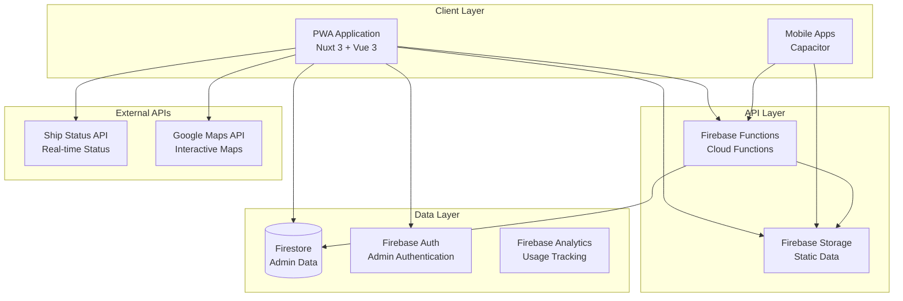
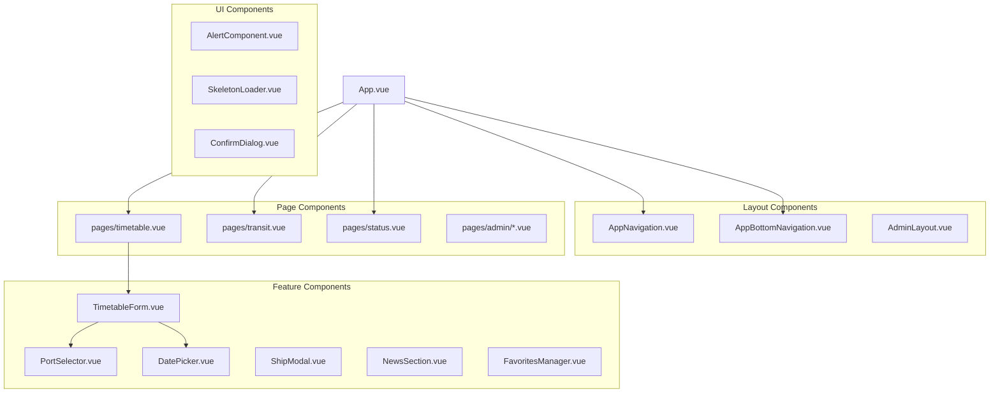
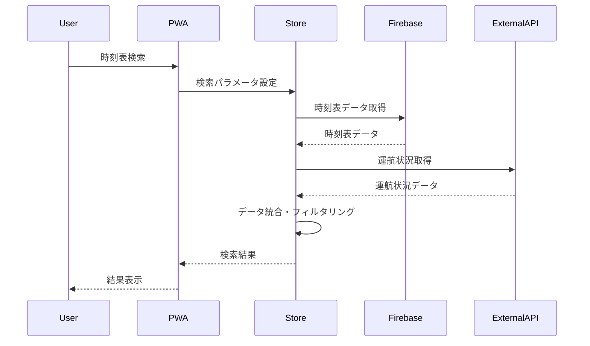

# Design Document

## Overview

FerryTransit システムは、島根県隠岐諸島のフェリー時刻表・航路情報を提供する包括的な Web アプリケーションです。Nuxt 3 をベースとしたプログレッシブ Web アプリ（PWA）として設計され、日本語・英語の多言語対応、リアルタイム運航状況、管理者機能を備えています。

### 設計原則

- **モバイルファースト**: スマートフォンでの利用を最優先に設計
- **プログレッシブエンハンスメント**: 基本機能から段階的に機能を拡張
- **オフライン対応**: ネットワーク接続がない環境でも基本機能を提供
- **アクセシビリティ**: WCAG 2.1 AA 準拠を目指した設計
- **パフォーマンス**: Lighthouse スコア 90+を目標とした最適化

## Architecture

### システム全体構成



### 技術スタック

#### フロントエンド

- **フレームワーク**: Nuxt 3.17.5 (Vue 3.5)
- **言語**: TypeScript (strict mode)
- **スタイリング**: Tailwind CSS v4.1.10
- **状態管理**: Pinia 2.4.0
- **国際化**: @nuxtjs/i18n 9.6
- **モバイル**: Capacitor 7.4.1

#### バックエンド・インフラ

- **認証**: Firebase Authentication
- **データベース**: Firebase Firestore
- **ストレージ**: Firebase Storage
- **サーバーレス**: Firebase Functions
- **ホスティング**: Firebase Hosting
- **分析**: Firebase Analytics

#### 開発・テスト

- **テスト**: Vitest + Vue Test Utils
- **リント**: ESLint + TypeScript
- **ビルド**: Vite (Nuxt 内蔵)

## Components and Interfaces

### コンポーネント階層



### 主要インターフェース

#### 時刻表データ構造

```typescript
interface Trip {
  tripId: number;
  startDate: string;
  endDate: string;
  name: string;
  departure: string;
  departureTime: Date | string;
  arrival: string;
  arrivalTime: Date | string;
  nextId?: number;
  status: TripStatus;
  price?: number;
  via?: string;
  departureLabel?: string;
  arrivalLabel?: string;
}

enum TripStatus {
  Hidden = -1,
  Normal = 0,
  Delay = 1,
  Cancel = 2,
  Change = 3,
  Extra = 4,
}
```

#### 港・船舶データ構造

```typescript
interface Port {
  id: string;
  name: string;
  nameEn: string;
  location: {
    lat: number;
    lng: number;
  };
  type: "mainland" | "dozen" | "dogo";
  mapIframe?: string;
}

interface Ship {
  id: string;
  name: string;
  nameEn: string;
  type: "ferry" | "highspeed" | "local";
  imageUrl?: string;
  color?: string;
}
```

#### 運航状況データ構造

```typescript
interface ShipStatus {
  id?: number;
  hasAlert: boolean;
  status: number;
  date: string | null;
  summary: string | null;
  comment: string | null;
  reason?: string;
  startTime?: string;
  lastShips?: any[];
  extraShips?: any[];
}
```

### 状態管理設計

#### Pinia ストア構成

```typescript
// stores/ferry.ts - フェリーデータ管理
interface FerryStore {
  // State
  timetableData: Trip[];
  shipStatus: ShipStatusCollection;
  selectedDate: Date;
  departure: string;
  arrival: string;
  isLoading: boolean;
  error: string | null;

  // Getters
  filteredTimetable: Trip[];
  alerts: Alert[];
  isDataStale: boolean;

  // Actions
  fetchTimetable(): Promise<void>;
  fetchShipStatus(): Promise<void>;
  setDeparture(port: string): void;
  setArrival(port: string): void;
  reverseRoute(): void;
}

// stores/ui.ts - UI状態管理
interface UIStore {
  theme: "light" | "dark" | "auto";
  locale: "ja" | "en";
  showMap: boolean;
  alerts: UIAlert[];
  isLoading: boolean;
}

// stores/favorite.ts - お気に入り管理
interface FavoriteStore {
  favoriteRoutes: FavoriteRoute[];
  favoritePorts: string[];
  searchHistory: SearchHistory[];
}

// stores/admin.ts - 管理者機能
interface AdminStore {
  user: AdminUser | null;
  permissions: AdminPermissions;
  isAuthenticated: boolean;
}
```

## Data Models

### データフロー設計



### データ永続化戦略

#### Firebase Firestore コレクション設計

```
/timetables          # 時刻表マスターデータ
  /{tripId}
    - tripId: number
    - startDate: string
    - endDate: string
    - name: string
    - departure: string
    - arrival: string
    - departureTime: string
    - arrivalTime: string
    - nextId?: number
    - status: number

/fares              # 料金マスターデータ
  /{fareId}
    - route: string
    - passengerFare: number
    - carFare?: number
    - peakSeasonMultiplier: number
    - discounts: Discount[]

/alerts             # 運航アラート
  /{alertId}
    - type: 'info' | 'warning' | 'danger'
    - title: { ja: string, en: string }
    - content: { ja: string, en: string }
    - affectedRoutes: string[]
    - validFrom: Timestamp
    - validTo: Timestamp
    - isActive: boolean

/news               # お知らせ
  /{newsId}
    - category: string
    - title: { ja: string, en: string }
    - content: { ja: string, en: string }
    - publishDate: Timestamp
    - status: 'draft' | 'published'
    - priority: 'low' | 'medium' | 'high'

/adminLogs          # 管理者操作ログ
  /{logId}
    - action: string
    - userId: string
    - timestamp: Timestamp
    - details: object
```

#### Firebase Storage 構造

```
/data/
  ├── timetable.json      # 公開用時刻表データ
  ├── fare-master.json    # 公開用料金データ
  ├── holidays.json       # 祝日データ
  └── alerts.json         # 公開用アラートデータ

/preview/               # プレビュー用データ
  └── [同上の構造]

/backups/               # バックアップデータ
  └── YYYY-MM-DD/
      └── [データスナップショット]
```

#### ローカルストレージ設計

```typescript
// LocalStorage キー設計
interface LocalStorageSchema {
  // ユーザー設定
  "ferry-transit-locale": "ja" | "en";
  "ferry-transit-theme": "light" | "dark" | "auto";
  "ferry-transit-show-map": boolean;

  // 検索状態
  departure: string;
  arrival: string;
  selectedDate: string;

  // お気に入り
  favoriteRoutes: FavoriteRoute[];
  favoritePorts: string[];
  searchHistory: SearchHistory[];

  // キャッシュデータ
  rawTimetable: any[];
  lastFetchTime: string;
  cachedShipStatus: ShipStatusCollection;
}
```

### 地図機能データモデル

#### 地図表示用データ構造

```typescript
interface MapData {
  ports: MapPort[];
  routes: MapRoute[];
  settings: MapSettings;
}

interface MapPort {
  id: string;
  name: { ja: string; en: string };
  coordinates: { lat: number; lng: number };
  type: "mainland" | "dozen" | "dogo";
  facilities: string[];
  accessInfo: { ja: string; en: string };
}

interface MapRoute {
  id: string;
  departure: string;
  arrival: string;
  coordinates: { lat: number; lng: number }[];
  ships: string[];
  isActive: boolean;
}

interface MapSettings {
  showMap: boolean;
  defaultZoom: number;
  centerCoordinates: { lat: number; lng: number };
  enableClustering: boolean;
}
```

## Error Handling

### エラー分類と処理戦略

#### 1. ネットワークエラー

```typescript
class NetworkErrorHandler {
  static async handleFetchError(error: Error, fallbackData?: any) {
    // オフライン検知
    if (!navigator.onLine) {
      return this.handleOfflineMode(fallbackData);
    }

    // リトライ機能
    return this.retryWithBackoff(error);
  }

  static handleOfflineMode(fallbackData?: any) {
    // キャッシュデータの利用
    // ユーザーへのオフライン通知
    // 基本機能の提供
  }
}
```

#### 2. データ検証エラー

```typescript
class DataValidationError extends Error {
  constructor(
    public field: string,
    public value: any,
    public expectedType: string
  ) {
    super(`Invalid ${field}: expected ${expectedType}, got ${typeof value}`);
  }
}

// 使用例
const validateTripData = (trip: any): Trip => {
  if (!trip.tripId || typeof trip.tripId !== "number") {
    throw new DataValidationError("tripId", trip.tripId, "number");
  }
  // その他の検証...
  return trip as Trip;
};
```

#### 3. 認証・認可エラー

```typescript
class AuthErrorHandler {
  static handleAuthError(error: FirebaseError) {
    switch (error.code) {
      case "auth/user-not-found":
        return { message: "ユーザーが見つかりません", action: "login" };
      case "auth/wrong-password":
        return { message: "パスワードが間違っています", action: "retry" };
      case "permission-denied":
        return { message: "アクセス権限がありません", action: "contact-admin" };
      default:
        return { message: "認証エラーが発生しました", action: "retry" };
    }
  }
}
```

#### 4. UI エラー表示システム

```typescript
interface ErrorDisplaySystem {
  // トースト通知
  showToast(message: string, type: "info" | "warning" | "error"): void;

  // インライン エラー
  showInlineError(fieldId: string, message: string): void;

  // モーダル エラー
  showErrorModal(title: string, message: string, actions: ErrorAction[]): void;

  // エラー境界
  handleComponentError(error: Error, componentName: string): void;
}
```

### エラー回復戦略

#### 自動回復機能

```typescript
class AutoRecoverySystem {
  // 指数バックオフによるリトライ
  static async retryWithBackoff<T>(
    operation: () => Promise<T>,
    maxRetries: number = 3,
    baseDelay: number = 1000
  ): Promise<T> {
    for (let attempt = 0; attempt < maxRetries; attempt++) {
      try {
        return await operation();
      } catch (error) {
        if (attempt === maxRetries - 1) throw error;

        const delay = baseDelay * Math.pow(2, attempt);
        await new Promise((resolve) => setTimeout(resolve, delay));
      }
    }
    throw new Error("Max retries exceeded");
  }

  // データ整合性チェック
  static validateDataIntegrity(data: any[]): boolean {
    // データの整合性を検証
    // 不整合がある場合は自動修復を試行
    return true;
  }
}
```

## Testing Strategy

### テスト戦略概要

#### テストピラミッド

```
    E2E Tests (10%)
   ┌─────────────────┐
   │ User Scenarios  │
   └─────────────────┘

  Integration Tests (20%)
 ┌─────────────────────┐
 │ Component + Store   │
 │ API Integration     │
 └─────────────────────┘

    Unit Tests (70%)
┌─────────────────────────┐
│ Functions, Composables  │
│ Components (isolated)   │
│ Store Logic            │
└─────────────────────────┘
```

#### 1. ユニットテスト設計

```typescript
// composables/useFerryData.test.ts
describe("useFerryData", () => {
  beforeEach(() => {
    // モックの初期化
    vi.clearAllMocks();
  });

  it("時刻表データを正しく取得する", async () => {
    // Given
    const mockData = createMockTimetableData();
    vi.mocked(fetchTimetable).mockResolvedValue(mockData);

    // When
    const { initializeData, timetableData } = useFerryData();
    await initializeData();

    // Then
    expect(timetableData.value).toEqual(mockData);
  });

  it("エラー時に適切なフォールバック処理を行う", async () => {
    // Given
    vi.mocked(fetchTimetable).mockRejectedValue(new Error("Network Error"));

    // When
    const { initializeData, error } = useFerryData();
    await initializeData();

    // Then
    expect(error.value).toBe("LOAD_TIMETABLE_ERROR");
  });
});
```

#### 2. コンポーネントテスト設計

```typescript
// components/TimetableForm.test.ts
describe("TimetableForm", () => {
  it("港選択時に適切なイベントが発火される", async () => {
    // Given
    const wrapper = mount(TimetableForm, {
      props: {
        departure: "",
        arrival: "",
        hondoPorts: ["HONDO_SHICHIRUI"],
        dozenPorts: ["BEPPU"],
        dogoPorts: ["SAIGO"],
      },
    });

    // When
    await wrapper.find("select").setValue("SAIGO");

    // Then
    expect(wrapper.emitted("update:departure")).toBeTruthy();
    expect(wrapper.emitted("update:departure")[0]).toEqual(["SAIGO"]);
  });

  it("アクセシビリティ要件を満たす", () => {
    const wrapper = mount(TimetableForm, { props: mockProps });

    // ラベルとフォーム要素の関連付け
    const labels = wrapper.findAll("label");
    const selects = wrapper.findAll("select");

    labels.forEach((label, index) => {
      expect(label.attributes("for")).toBeDefined();
      expect(selects[index].attributes("id")).toBe(label.attributes("for"));
    });
  });
});
```

#### 3. 統合テスト設計

```typescript
// integration/ferry-search.test.ts
describe("フェリー検索統合テスト", () => {
  it("検索から結果表示まで正常に動作する", async () => {
    // Given
    const { wrapper } = await mountWithProviders(TimetablePage);

    // When
    await wrapper.find('[data-testid="departure-select"]').setValue("SAIGO");
    await wrapper.find('[data-testid="arrival-select"]').setValue("HONDO");
    await wrapper.find('[data-testid="search-button"]').trigger("click");

    // Then
    await waitFor(() => {
      expect(wrapper.find('[data-testid="search-results"]')).toBeTruthy();
    });
  });
});
```

#### 4. E2E テスト設計

```typescript
// e2e/user-journey.spec.ts
test("ユーザーが時刻表を検索して結果を確認できる", async ({ page }) => {
  // Given
  await page.goto("/");

  // When
  await page.selectOption('[data-testid="departure-select"]', "SAIGO");
  await page.selectOption('[data-testid="arrival-select"]', "HONDO");
  await page.click('[data-testid="search-button"]');

  // Then
  await expect(page.locator('[data-testid="search-results"]')).toBeVisible();
  await expect(page.locator(".trip-item")).toHaveCount.greaterThan(0);
});
```

### テストデータ管理

#### モックデータファクトリー

```typescript
// test/factories/ferry.ts
export const createMockTrip = (overrides: Partial<Trip> = {}): Trip => ({
  tripId: 1,
  startDate: "2024-01-01",
  endDate: "2024-12-31",
  name: "FERRY_OKI",
  departure: "SAIGO",
  arrival: "HONDO_SHICHIRUI",
  departureTime: "08:00",
  arrivalTime: "10:30",
  status: TripStatus.Normal,
  ...overrides,
});

export const createMockTimetableData = (count: number = 5): Trip[] => {
  return Array.from({ length: count }, (_, index) =>
    createMockTrip({ tripId: index + 1 })
  );
};
```

### パフォーマンステスト

#### Lighthouse CI 設定

```yaml
# .github/workflows/lighthouse.yml
- name: Run Lighthouse CI
  run: |
    npm install -g @lhci/cli@0.12.x
    lhci autorun
  env:
    LHCI_GITHUB_APP_TOKEN: ${{ secrets.LHCI_GITHUB_APP_TOKEN }}
```

#### パフォーマンス監視

```typescript
// utils/performance.ts
export class PerformanceMonitor {
  static measurePageLoad(pageName: string) {
    const startTime = performance.now();

    return {
      end: () => {
        const endTime = performance.now();
        const duration = endTime - startTime;

        // Firebase Analytics に送信
        this.trackPerformance(pageName, duration);
      },
    };
  }

  static trackPerformance(pageName: string, duration: number) {
    if (typeof gtag !== "undefined") {
      gtag("event", "page_load_time", {
        page_name: pageName,
        duration: Math.round(duration),
      });
    }
  }
}
```

この設計書は、要件書で定義された 11 の要件すべてに対応する包括的なシステム設計を提供しています。特に新しく追加された地図機能についても詳細な設計を含めています。
