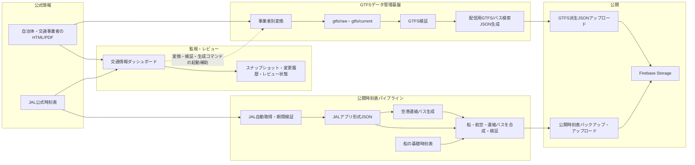
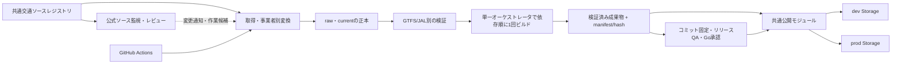

# 交通データ管理・合成・配信パイプライン

## この文書の目的

GTFSデータ管理基盤、公開時刻表の合成・配信、交通情報ダッシュボード、JAL時刻表の自動取得・更新、JAL更新の定期実行について、現状の関係と正本を整理し、重複処理を統合する方針を定める。

この文書は設計・運用上の基準である。Phase 1からPhase 3は2026-07-14に実装済みである。

## 結論

- 交通情報ダッシュボードは、公式情報の**監視・差分検知・レビュー・作業開始**を担当する。公開データの正本や本番スケジューラにはしない。
- GTFSデータ管理基盤は、事業者別GTFSの**原本・採用・検証・派生JSON生成**を担当する。
- JAL取得処理は、公式サイトから航空便を**構造化データとして取得・検証**する。ダッシュボードによるJALページ監視とは目的が異なるため、取得処理自体は分離したまま、URLや路線定義だけを共通化する。
- 公開時刻表の合成処理は、船・JAL・空港連絡バスを**一度だけビルド**し、検証済み成果物を配信処理へ渡す。
- GitHub Actionsは、JAL更新を継続実行する**唯一の定期実行主体**とする。ダッシュボードの24時間更新は、ダッシュボード起動中だけの監視補助である。
- Firebase Storageの `data/timetable.json` は、コード管理された合成時刻表だけを正本とし、書き込み口を1つに限定する。管理画面や旧スクリプトから同じパスを上書きしない。
- 定期更新はdevへ公開する。本番への昇格はデータ公開元コミットを固定し、データ差分レビュー、dev manifest/smoke、本番変更承認、prod manifest/smokeを経て行う。アプリのリリースQA・Go承認とは独立して先行できる。

## 用語とデータの区分

| 区分 | 意味 | 例 |
| --- | --- | --- |
| 公式ソース | 自治体、交通事業者、空港等が公開するHTML、PDF、時刻表 | JAL国内線時刻表、町営バスPDF |
| 監視スナップショット | 公式ソースの変更を発見するためのローカル記録 | `tools/oki-transport-dashboard/data/snapshots/` |
| 原本 | 取得・変換の根拠として保持する入力 | `gtfs/raw/`、`gtfs/pdf/` |
| 採用中データ | アプリ用派生データを生成する際に採用するGTFS | `gtfs/current/` |
| 生成物 | 原本・採用中データから再生成できるJSON | `gtfs/public-data/`、`gtfs/generated/` |
| 公開物 | アプリがFirebase Storageから読むオブジェクト | `data/timetable.json`、`data/gtfs/**`、`data/bus-search/**` |

`gtfs/raw/air/jal_oki_timetable.json` は配置上 `gtfs/raw/` 配下にあるが、GTFS CSVではなくアプリ時刻表形式のJSONである。GTFSバリデータの対象にはせず、JAL用の取得・期間検証を適用する。

## 現在の全体関係



ダッシュボードのJAL監視は「ページや資料が変わったこと」の検知であり、JAL取得スクリプトは「便、時刻、運航期間をアプリ形式へ変換すること」が目的である。両方から同じ構造化時刻表を作らない。

## 5機能の責務

| 機能 | 主な入口 | 入力 | 出力 | 実行主体 | 責務に含めないもの |
| --- | --- | --- | --- | --- | --- |
| GTFSデータ管理基盤 | `scripts/gtfs/*.mjs` | 公式PDF等、`gtfs/raw/`、`gtfs/current/` | 検証レポート、`gtfs/public-data/data/gtfs/**`、`data/bus-search/**` | 開発者、ダッシュボードからのコマンド実行 | JAL HTML解析、本番時刻表の合成、定期実行 |
| 公開時刻表の合成・配信 | `timetable:build`、`timetable:publish` | `timetable.json`、JAL JSON、空港連絡バスJSON | `gtfs/generated/public/timetable.json`、Storageの `data/timetable.json` | 開発者、GitHub Actions | 公式ページの監視、GTFS原本の採用判断 |
| 交通情報ダッシュボード | `tools/oki-transport-dashboard` | 公式HTML/PDF/画像、GTFSメタ情報 | スナップショット、差分、レビュー状態、GTFS下書き、CLI実行結果 | ローカルで起動した担当者 | 本番公開、永続的なスケジュール実行、無人での採用判断 |
| JAL時刻表の自動取得・更新 | `timetable:fetch:jal`、`timetable:refresh:jal` | JAL公式国内線時刻表 | `gtfs/raw/air/jal_oki_timetable.json` と再生成物 | 開発者、GitHub Actions | 一般的な公式ページ変更監視、Firebaseへの直接公開 |
| JAL更新の定期実行 | `.github/workflows/update-jal-timetable.yml` | リポジトリ、JAL公式サイト、dev用資格情報 | dev向け生成物、dev Storage、自動コミット | GitHub Actions | 本番への自動昇格、ダッシュボードの起動管理 |

## Phase 2で導入した共通基盤

- `config/transport-sources.mjs`: source ID、公式URL、GTFS feed ID、取得・変換タスクを関連付ける正本。ダッシュボード、JAL取得、事業者別変換が参照する。
- `config/bus-feeds.json`: バスfeed ID、公開パス、停留所prefix、事業者ID、便名、運賃、アプリ用trip ID領域の正本。
- `npm run gtfs:config:generate`: バス設定からNode用 `scripts/generated/bus-feed-config.mjs` とアプリ用 `src/generated/busFeedConfig.ts` を生成する。生成物は直接編集しない。
- `scripts/lib/transport-data.mjs`: CSV読込、GTFS日付・時刻、JSON・レポート出力、SHA-256、公開manifestを共通化する。
- `scripts/lib/firebase-storage-publisher.mjs`: 認証、公開先解決、差分判定、バックアップ、アップロード、公開後ハッシュ検証を共通化する。
- `scripts/assert-no-bundled-timetable.mjs`: Capacitor用Web成果物に `timetable.json`、GTFS、bus-searchデータが含まれないことを検査する。

アプリへ生成するのはバスfeedの設定コードだけで、時刻表・GTFS JSONは同梱しない。アプリはFirebase Storageの公開物を実行時に取得する。`cap-build.mjs` は生成後に非同梱チェックを必須実行し、違反があればネイティブ同期前に停止する。

## 現在のデータフロー

### 1. 事業者別GTFSの更新

1. 公式資料を `gtfs/pdf/` または `gtfs/raw/` に保存する。
2. 事業者別変換スクリプトでGTFS候補を生成する。
3. 内容をレビューし、採用するデータを `gtfs/current/{mode}/{id}/` に置く。
4. `npm run gtfs:validate -- {mode} {id}` で基本項目、参照整合性、フィード期間を検証し、`gtfs/reports/` に記録する。
5. `npm run gtfs:build -- {mode} {id}` でアプリ向けJSONを `gtfs/public-data/data/` に生成する。
6. `npm run transport:publish -- --source <source-id> --target dev --git-sha <commit-sha>` で `data/gtfs/**` と `data/bus-search/**` へ公開する。本番はdev manifestから昇格する。

`gtfs:upload` は各オブジェクトの変更前バックアップ、公開後SHA-256検証を共通公開モジュールで行い、最後に `data/manifests/gtfs-public-data.json` を公開する。manifestには公開対象パス、ハッシュ、サイズ、環境、Git SHAを記録する。

ダッシュボードはこの作業の資料発見、レビュー、GTFS下書き、変換・検証・生成コマンドの起動を補助する。`gtfs/current/` の採用判断とStorage公開を自動では行わない。

### 2. JALと公開時刻表の手動更新

現在の `npm run timetable:refresh:jal` は次を行う。

1. PlaywrightでJAL公式時刻表を取得する。
2. 対象路線、対象期間、日ごとの欠損を検証する。
3. `gtfs/raw/air/jal_oki_timetable.json` を更新する。
4. JAL便を基準に空港連絡バスを生成する。
5. 船・JAL・空港連絡バスを `gtfs/generated/public/timetable.json` へ合成する。

`npm run timetable:build` は、JAL JSONから空港連絡バスをメモリ上で生成し、船・JAL・空港連絡バスを1回で検証・出力する。`npm run timetable:build:dry-run` は同じ処理を行うが、管理対象ファイルへ書き込まない。

公開済みのv2.4との互換性を維持するため、`ISOKAZE`と`FERRY_DOZEN`の公式便ではtrip ID `1000`〜`2999`を使用しない。この範囲は旧アプリが運航状況API由来の臨時便へ割り当てる予約帯であり、公開時刻表の共通検証で混入を拒否する。新しいアプリも同じ単一の`data/timetable.json`を取得するが、実行時は公式時刻表と運航状況由来の臨時便を別々に保持する。

`npm run transport:publish -- --source jal-oki-flights --target dev --git-sha <commit-sha>` は生成済み公開時刻表を再ビルドせず、検証、既存データとの差分確認、バックアップ、アップロード、manifest生成、アップロード後のSHA-256検証だけを行う。本番への直接publishは拒否し、dev manifestから昇格する。

### 3. JAL定期更新

GitHub Actionsは毎日03:17 JSTに `dev` をチェックアウトし、次の順で実行する。

```text
JAL取得 → 公開時刻表を1回生成 → 差分判定 → devへコミット・push → 同じ成果物をdev Storageへ公開・ハッシュ検証
```

同じworkflowの並行実行はconcurrencyで直列化する。入力と生成物に差分がない場合はコミット、バックアップ、公開をすべて省略する。公開はpush成功後に行い、公開メタデータへコミットSHAと成果物ハッシュを記録する。

dev Storageへの認証は、`ag-k/FerryTransit`に限定したGitHub OIDCと専用サービスアカウントのWorkload Identity Federationを使用する。長期サービスアカウント鍵は発行せず、専用サービスアカウントにはdev公開バケットだけの`roles/storage.objectAdmin`を付与する。

### 4. ダッシュボードの定期監視

ダッシュボードは起動中に、保存済みスナップショットが24時間以上古ければ公式ページを再収集する。このタイマーは次の理由から、JAL更新のGitHub Actionsを置き換えない。

- ローカルプロセスが停止すると動かない。
- 目的は変更検知とレビューであり、構造化時刻表の確定・公開ではない。
- ダッシュボードが見つけた資料は、事業者別変換または手動確認を経て採用する必要がある。

## 正本と書き込み責任

| データ・公開先 | 現在の主な生成元 | 目標とする唯一の書き込み責任者 |
| --- | --- | --- |
| `gtfs/raw/{mode}/{id}/` | 取得物、事業者別変換 | 取得・変換処理。履歴として上書きを避ける |
| `gtfs/current/{mode}/{id}/` | レビュー済みGTFS | GTFS採用操作 |
| `gtfs/reports/{mode}/{id}/` | `gtfs:validate` 等 | 対応する検証処理 |
| `gtfs/public-data/data/gtfs/**` | `gtfs:build` | GTFS派生データビルダー |
| `gtfs/public-data/data/bus-search/**` | `gtfs:build` | GTFS派生データビルダー |
| `gtfs/raw/air/jal_oki_timetable.json` | JAL取得スクリプト | JAL取得・検証処理 |
| `gtfs/generated/bus/oki_airport_bus_timetable.json` | 空港連絡バス生成スクリプト | 公開時刻表ビルダー |
| `gtfs/generated/public/timetable.json` | 公開時刻表合成スクリプト | 公開時刻表ビルダー |
| Storage `data/gtfs/**`、`data/bus-search/**` | `gtfs:upload` | 共通公開モジュール経由のGTFS公開処理 |
| Storage `data/timetable.json` | 現在は複数経路が存在 | 共通公開モジュール経由の合成時刻表公開処理のみ |

## 重複・競合している処理

優先度は、データ破壊や誤公開の可能性を基準にしている。

### 対応済み（Phase 1）: `data/timetable.json` の書き込み口を限定

Phase 1実装前は、コード管理された合成時刻表の公開処理に加えて、次の経路も同じStorageパスを書き込めた。

- `src/composables/useDataPublish.ts`: 管理画面クライアントからFirestoreの `timetables` を整形して公開
- `src/functions/src/admin/publish.ts`: Cloud FunctionsからFirestoreの時刻表を公開
- `src/scripts/upload-to-storage.mjs`、同種の旧アップロードスクリプト: 生成JSONを直接公開
- `scripts/upload-timetable-data.mjs`: Emulator向けに同じオブジェクトパスへ公開

Firestore版とコード管理版は入力・整形処理が異なるため、最後に実行した経路が正本を置き換える危険があった。管理画面は `preview/timetable.json` の生成だけに変更し、Cloud Functionsの時刻表公開・ロールバックを拒否し、旧一括アップロードスクリプトの対象から時刻表を除外した。Emulator専用の `scripts/upload-timetable-data.mjs` はローカル検証用として残す。

Cloud Functions側の拒否は、変更したFunctionsを対象環境へデプロイした後に有効になる。デプロイ前でも現行フロントエンドは本番公開・ロールバックを拒否するが、v2.4 QAではFunctionsの反映も確認する。

### 対応済み（Phase 1）: 公開前の二重生成

`timetable:publish` をpublish-onlyへ変更し、`timetable:refresh:jal` が生成した1回のビルド結果をそのまま公開する。

### 対応済み（Phase 1）: dry-runの読み取り専用化

空港連絡バスをメモリ上で公開時刻表へ渡すビルドパイプラインへ変更した。`timetable:build:dry-run` と `timetable:publish:dry-run` は管理対象ファイルとStorageを変更しない。

### 対応済み（Phase 1）: 公開先の明示

GTFSアップロードと公開時刻表の配信は、`--target dev|prod` または `--bucket` を必須にした。環境変数がない場合の本番バケット既定値は使用しない。prodはリリース承認済みのコミットからだけ実行する。

### 対応済み（Phase 2）: ソース・路線・事業者設定の共通化

次の情報が複数箇所に重複している。

- 公式URL・更新方針: `gtfs/sources/*.json`、ダッシュボードの `src/sources.mjs`、JAL取得スクリプト
- GTFS変換コマンド: `package.json`、ダッシュボードの変換タスク定義
- バスフィードのID、公開パス、便名、運賃等: GTFSビルダーとアプリの `src/utils/gtfsBusTimetable.ts`

交通ソースレジストリとバスfeedレジストリを正本にし、CLIとダッシュボードはsource IDで参照する。ブラウザに不要なコマンド情報を含めないよう、アプリ用設定は必要項目だけをTypeScriptへ生成する。

### 対応済み（Phase 2）: Firebase公開処理の共通化

Firebase Admin初期化、サービスアカウントの読込、バケット選択、JSONアップロード、バックアップ、ハッシュ検証を共通公開モジュールへ集約した。GTFS公開は公開manifestも生成する。

### 対応済み（Phase 2）: 解析・検証の共通部品

CSVローダー、GTFS日付・時刻、JSON・レポート出力、ハッシュ、manifestを共通化した。一方、GTFS参照整合性とJAL掲載期間の検証はドメインが異なるため、個別バリデータとして残す。

### P2: ダッシュボードと定期実行の名称が紛らわしい

ダッシュボードの24時間更新は「ソース監視」、GitHub Actionsの毎日実行は「JAL構造化データ更新」である。UI・文書・ログでは `source-monitor` と `jal-data-refresh` のように目的が分かる名称を使う。

## 目標構成



### 共通交通ソースレジストリ

`config/transport-sources.mjs` と `config/bus-feeds.json` を設け、次の共通項目を一元管理する。

- 安定したsource ID、交通モード、事業者ID
- 公式ページ・資料URLと監視対象
- 取得方法または変換タスクID
- raw/current/generatedの入出力
- 更新頻度、手動レビュー要否、ライセンス・出典
- 公開対象とアプリ向け表示ID

秘密情報、サービスアカウント、環境別バケットはレジストリへ入れない。`gtfs/sources/*.json` は採用日、ライセンス、注意事項などfeed固有の運用記録として残し、共通レジストリがsource IDとfeed IDで関連付ける。ダッシュボード固有の表示キーワードはsource IDを参照する補助設定に分ける。

### ビルドと公開の分離

目標とするコマンドの責務は次のとおりとする。コマンド名は実装時に確定するが、責務は混ぜない。

| コマンド例 | 責務 | ファイル書き込み | Storage書き込み |
| --- | --- | --- | --- |
| `transport:acquire --source jal_oki` | 公式ソースの取得と正規化 | rawのみ | なし |
| `transport:check --scope timetable` | 入力・生成結果の検証 | レポートまたは一時領域のみ | なし |
| `transport:build --scope timetable` | 依存順に1回だけ生成 | generatedのみ | なし |
| `transport:publish --scope timetable --target dev --git-sha <commit-sha>` | 既存成果物のハッシュ確認、バックアップ、公開 | manifestのみ | あり |
| `transport:update --source jal_oki --target dev --git-sha <commit-sha>` | 上記コマンドを順序どおり呼ぶオーケストレータ | 各段階の規則に従う | 最終段階のみ |

公開処理は成果物を再ビルドしない。ビルド時に入力ファイル、Git SHA、生成日時、件数、SHA-256等をmanifestへ記録し、公開時と公開後の確認に使う。

### JAL定期更新の目標順序

1. `dev` の対象コミットを取得し、同じsource IDの並行実行を禁止する。
2. JAL公式時刻表を取得し、路線・掲載期間・日別カバレッジを検証する。
3. 空港連絡バスと公開時刻表を1回だけ生成し、全体を検証する。
4. 入力・出力ハッシュが前回と同じなら、バックアップ・公開・コミットを省略して成功終了する。
5. 変更があれば入力、生成物、manifestをコミットして `dev` へpushする。
6. そのコミットと同じ成果物をdev Storageへ公開する。
7. 公開URLから取得して、ハッシュ、件数、対象期間、主要便をスモーク確認する。

Gitへのpush後に公開が失敗した場合は、同じコミットの成果物をpublish-onlyで再実行できるようにする。本番はこの定期ジョブから更新せず、v2.4等のリリースTODOで対象コミットとデータ差分を確認して昇格する。

## 統合しない処理

重複削減のために、異なる責務まで1つの巨大スクリプトへまとめない。

- ダッシュボードのHTML/PDF変更監視と、JAL便の構造化取得は分ける。共有するのはsource ID、URL、更新方針、結果通知である。
- GTFS検証と公開時刻表検証は分ける。共有するのはファイル読込、日付・時刻処理、レポート形式である。
- `data/gtfs/**` と `data/timetable.json` は利用側とデータ粒度が異なるため、1つの巨大JSONにはしない。公開ライブラリとmanifestだけを共通化する。
- 事業者別PDF変換は資料形式が異なるため個別に保つ。変換タスク登録、CLI引数、出力先、検証の呼び出し方を共通化する。

## 段階的な移行計画

### Phase 1: 誤公開と二重処理を止める

- [x] `data/timetable.json` の書き込み経路を棚卸しし、合成パイプライン以外をpreviewまたはEmulator専用へ変更する。
- [x] `timetable:publish` をpublish-onlyへ分離し、JAL定期更新の二重ビルドを解消する。
- [x] 公開先 `dev|prod` の明示を必須にし、暗黙の本番バケット既定値をなくす。
- [x] `--dry-run` / `--check` を書き込みなしにする。
- [x] GitHub Actionsにconcurrency、無変更時のスキップ、コミットと公開物の一致確認を追加する。

### Phase 2: 共通設定と共通部品を作る

- [x] 共通交通ソースレジストリを導入し、GTFSメタ情報、ダッシュボード、JAL URL、変換タスクをsource IDで関連付ける。
- [x] Firebase認証、バケット選択、バックアップ、アップロード、ハッシュ確認を共通公開モジュールへ集約する。
- [x] CSV読込、日付・時刻正規化、検証レポート、manifest生成を共通ライブラリへ移す。
- [x] バスフィード設定から、ビルダー用設定とアプリ用設定を生成してID・パスのずれを防ぐ。
- [x] アプリ成果物へ時刻表・GTFS JSONを同梱せず、Capacitor同期前に自動検査する。

### Phase 3: オーケストレータと運用画面を揃える

- [x] `acquire → validate → build → publish → smoke` を `transport:*` オーケストレータで実行する。
- [x] ダッシュボードはsource IDとタスクIDを使って同じ `transport:*` CLIを呼び、独自の事業者別コマンド対応表を廃止する。
- [x] source監視とJALデータ更新の名称・責務を分離する。source監視CIは現時点では追加せず、ローカルレビュー補助のままとする。
- [x] devからprodへの昇格を、データ公開元コミットSHAとdev Storage上のmanifestを指定する `transport:promote` へ変更する。

Phase 3の共通CLIは次のとおり。`transport:update` はdev専用で、prodへの直接公開を拒否する。

```bash
npm run transport:acquire -- --source jal-oki-flights
npm run transport:check -- --source jal-oki-flights
npm run transport:build -- --source jal-oki-flights
npm run transport:publish -- --source jal-oki-flights --target dev --git-sha <commit-sha>
npm run transport:smoke -- --source jal-oki-flights --target dev --git-sha <commit-sha>
npm run transport:update -- --source jal-oki-flights --target dev --git-sha <commit-sha>
```

本番昇格はdevに公開済みの実体を再利用し、manifest内の環境、Git SHA、全オブジェクトのSHA-256・サイズを照合してから実行する。ここで指定するGit SHAはアプリのリリースコミットである必要はなく、公開データ一式を特定できるデータ公開元コミットとする。時刻表・GTFS・bus-searchはアプリのバイナリ公開と独立して更新できる。

devへの実公開にも40桁のGit SHAが必須で、オーケストレータは`--git-sha`を`SOURCE_GIT_SHA`として公開処理へ渡す。SHAなしのmanifestはprod昇格不能になるため生成を拒否する。

```bash
npm run transport:promote -- \
  --from dev \
  --target prod \
  --manifest data/manifests/public-timetable.json \
  --git-sha <data-source-commit-sha> \
  --approve-prod
```

確認だけの場合は `--dry-run` を付ける。`--approve-prod`、40桁のコミットSHA、manifestの一致が1つでも欠けた場合は昇格しない。

## 完了条件

- Storageの各公開オブジェクトについて、正本、生成元、唯一の書き込み責任者を説明できる。
- 同じ入力に対するbuildが1パイプライン中に1回だけ実行される。
- dry-run/checkではGit管理ファイルとStorageが変更されない。
- 公開先がコマンドラインまたはCI設定で明示され、資格情報がログやmanifestに残らない。
- 無変更の定期実行ではコミット、バックアップ、Storage更新が発生しない。
- devに記録されたGit SHA・manifest・Storage公開物のハッシュが一致する。
- 管理画面、Cloud Functions、旧スクリプトから `data/timetable.json` を上書きできない。
- ダッシュボード停止中でもJAL定期更新が実行され、ダッシュボード起動だけでは公開データが変わらない。
- 本番データ公開はデータ差分のレビュー、dev manifest/smoke、本番変更承認、prod manifest/smokeを通過する。アプリのバージョン別リリースQAとGo承認は、データ公開とは独立して管理する。

## 関連資料

- [GTFSデータ管理](../../gtfs/README.md)
- [JAL時刻表の自動更新](jal-timetable.md)
- [交通情報ダッシュボード](../../tools/oki-transport-dashboard/README.md)
- [v2.4 リリースTODO](../releases/v2.4.md)
